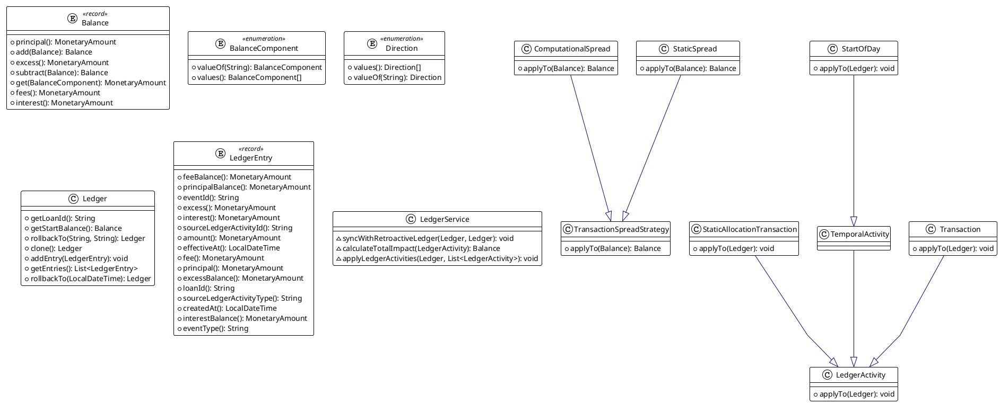
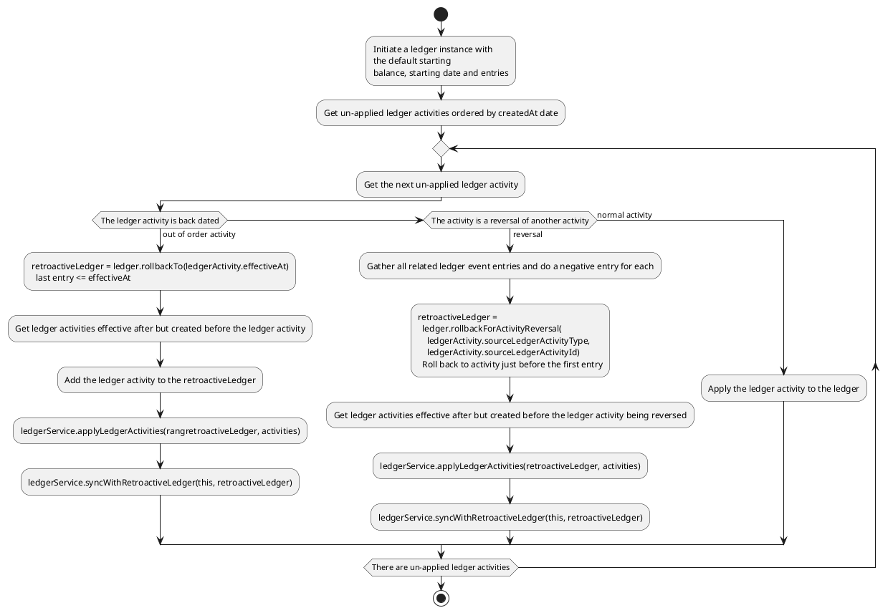

### Class Diagram

```plantuml
@startuml

!theme plain
top to bottom direction
skinparam linetype polyline

entity Balance << record >> {
  + principal(): MonetaryAmount
  + add(Balance): Balance
  + excess(): MonetaryAmount
  + subtract(Balance): Balance
  + get(BalanceComponent): MonetaryAmount
  + fees(): MonetaryAmount
  + interest(): MonetaryAmount
}
enum BalanceComponent << enumeration >> {
  + valueOf(String): BalanceComponent
  + values(): BalanceComponent[]
}
class ComputationalSpread {
  + applyTo(Balance): Balance
}
enum Direction << enumeration >> {
  + values(): Direction[]
  + valueOf(String): Direction
}
class Ledger {
  + getLoanId(): String
  + getStartBalance(): Balance
  + rollbackTo(String, String): Ledger
  + clone(): Ledger
  + addEntry(LedgerEntry): void
  + getEntries(): List<LedgerEntry>
  + rollbackTo(LocalDateTime): Ledger
}
class LedgerActivity {
  + applyTo(Ledger): void
}
entity LedgerEntry << record >> {
  + feeBalance(): MonetaryAmount
  + principalBalance(): MonetaryAmount
  + eventId(): String
  + excess(): MonetaryAmount
  + interest(): MonetaryAmount
  + sourceLedgerActivityId(): String
  + amount(): MonetaryAmount
  + effectiveAt(): LocalDateTime
  + fee(): MonetaryAmount
  + principal(): MonetaryAmount
  + excessBalance(): MonetaryAmount
  + loanId(): String
  + sourceLedgerActivityType(): String
  + createdAt(): LocalDateTime
  + interestBalance(): MonetaryAmount
  + eventType(): String
}
class LedgerService {
  ~ syncWithRetroactiveLedger(Ledger, Ledger): void
  ~ calculateTotalImpact(LedgerActivity): Balance
  ~ applyLedgerActivities(Ledger, List<LedgerActivity>): void
}
class StartOfDay {
  + applyTo(Ledger): void
}
class StaticAllocationTransaction {
  + applyTo(Ledger): void
}
class StaticSpread {
  + applyTo(Balance): Balance
}
class TemporalActivity
class Transaction {
  + applyTo(Ledger): void
}
class TransactionSpreadStrategy {
  + applyTo(Balance): Balance
}

ComputationalSpread          -[#000082,plain]-^  TransactionSpreadStrategy   
StartOfDay                   -[#000082,plain]-^  TemporalActivity            
StaticAllocationTransaction  -[#000082,plain]-^  LedgerActivity              
StaticSpread                 -[#000082,plain]-^  TransactionSpreadStrategy   
TemporalActivity             -[#000082,plain]-^  LedgerActivity              
Transaction                  -[#000082,plain]-^  LedgerActivity              
@enduml

```

### Core Algorithm

```plantuml
@startuml
start
:Initiate a ledger instance with 
the default starting 
balance, starting date and entries;

:Get un-applied ledger activities ordered by createdAt date;

repeat
  :Get the next un-applied ledger activity;
      if (The ledger activity is back dated) then (out of order activity)
        :retroactiveLedger = ledger.rollbackTo(ledgerActivity.effectiveAt)
          last entry <= effectiveAt;
        :Get ledger activities effective after but created before the ledger activity;
        :Add the ledger activity to the retroactiveLedger;
        :ledgerService.applyLedgerActivities(rangretroactiveLedger, activities);
        :ledgerService.syncWithRetroactiveLedger(this, retroactiveLedger);
      else if (The activity is a reversal of another activity) then (reversal)
        :Gather all related ledger event entries and do a negative entry for each;
        :retroactiveLedger = 
          ledger.rollbackForActivityReversal(
            ledgerActivity.sourceLedgerActivityType, 
            ledgerActivity.sourceLedgerActivityId)
          Roll back to activity just before the first entry;
        :Get ledger activities effective after but created before the ledger activity being reversed;
        :ledgerService.applyLedgerActivities(retroactiveLedger, activities);
        :ledgerService.syncWithRetroactiveLedger(this, retroactiveLedger);
      else (normal activity)
        :Apply the ledger activity to the ledger;
      endif
repeat while (There are un-applied ledger activities)
stop
@enduml
```