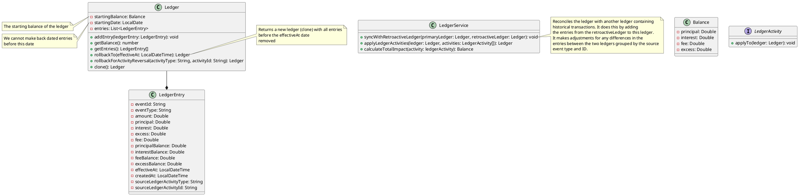
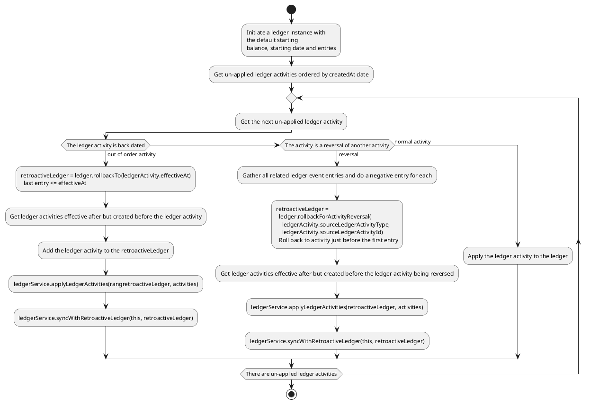

### Class Diagram

```plantuml
@startuml
class Balance {
  - principal: Double
  - interest: Double
  - fee: Double
  - excess: Double
}

class "Ledger" as ledger {
  - startingBalance: Balance 
  - startingDate: LocalDate
  - entries: List<LedgerEntry>
  + addEntry(ledgerEntry: LedgerEntry): void
  + getBalance(): number
  + getEntries(): LedgerEntry[]
  + rollbackTo(effectiveAt: LocalDateTime): Ledger
  + rollbackForActivityReversal(activityType: String, activityId: String): Ledger
  + clone(): Ledger
}

class "LedgerService" as ledgerService {
  + syncWithRetroactiveLedger(primaryLedger: Ledger, retroactiveLedger: Ledger): void
  + applyLedgerActivities(ledger: Ledger, activities: LedgerActivity[]): Ledger
  + calculateTotalImpact(activity: ledgerActivity): Balance
}

note left of ledger::startingBalance
  The starting balance of the ledger
end note

note left of ledger::startingDate
  We cannot make back dated entries
  before this date
end note

note right of ledger::rollbackTo
  Returns a new ledger (clone) with all entries
  before the effectiveAt date
  removed
end note

note right of ledgerService::syncWithRetroactiveLedger
  Reconciles the ledger with another ledger containing
  historical transactions. It does this by adding 
  the entries from the retroactiveLedger to this ledger.
  It makes adjustments for any differences in the 
  entries between the two ledgers grouped by the source
  event type and ID.
end note

class "LedgerEntry" as ledgerEntry {
    - eventId: String
    - eventType: String
    - amount: Double
    - principal: Double
    - interest: Double
    - excess: Double
    - fee: Double
    - principalBalance: Double
    - interestBalance: Double
    - feeBalance: Double
    - excessBalance: Double
    - effectiveAt: LocalDateTime
    - createdAt: LocalDateTime
    - sourceLedgerActivityType: String
    - sourceLedgerActivityId: String
}

ledger --* ledgerEntry

interface "LedgerActivity" as ledgerActivity {
    + applyTo(ledger: Ledger): void
}
@enduml
```

### Core Algorithm

```plantuml
@startuml
start
:Initiate a ledger instance with 
the default starting 
balance, starting date and entries;

:Get un-applied ledger activities ordered by createdAt date;

repeat
  :Get the next un-applied ledger activity;
      if (The ledger activity is back dated) then (out of order activity)
        :retroactiveLedger = ledger.rollbackTo(ledgerActivity.effectiveAt)
          last entry <= effectiveAt;
        :Get ledger activities effective after but created before the ledger activity;
        :Add the ledger activity to the retroactiveLedger;
        :ledgerService.applyLedgerActivities(rangretroactiveLedger, activities);
        :ledgerService.syncWithRetroactiveLedger(this, retroactiveLedger);
      else if (The activity is a reversal of another activity) then (reversal)
        :Gather all related ledger event entries and do a negative entry for each;
        :retroactiveLedger = 
          ledger.rollbackForActivityReversal(
            ledgerActivity.sourceLedgerActivityType, 
            ledgerActivity.sourceLedgerActivityId)
          Roll back to activity just before the first entry;
        :Get ledger activities effective after but created before the ledger activity being reversed;
        :ledgerService.applyLedgerActivities(retroactiveLedger, activities);
        :ledgerService.syncWithRetroactiveLedger(this, retroactiveLedger);
      else (normal activity)
        :Apply the ledger activity to the ledger;
      endif
repeat while (There are un-applied ledger activities)
stop
@enduml
```